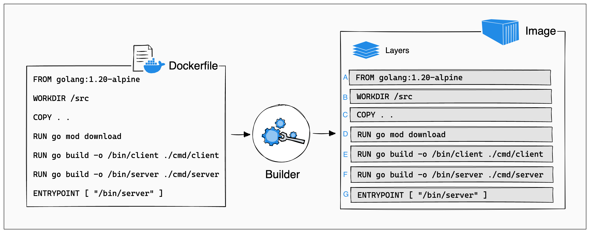

# Introducción

Muchas veces se intercambia la palabra *Docker* y *contenedores*, y aunque son parecidas, son cosas diferentes.

**Docker** es una empresa que desarrolló varios productos enfocados a contenedores. Mientras que los **contenedores** son una tecnología basada en los [cgroups](https://en.wikipedia.org/wiki/Cgroups) de Linux.

!> Si quieres saber más sobre cgroups te recomiendo este artículo (4 partes)  
https://www.redhat.com/sysadmin/cgroups-part-one  
https://www.redhat.com/sysadmin/cgroups-part-two  
https://www.redhat.com/sysadmin/cgroups-part-three  
https://www.redhat.com/sysadmin/cgroups-part-four

**Docker** ayudó mucho a popularizar la tecnología de contenedores entre los desarrolladores.

Los contenedores son una forma de paquetizar software y poder correrlo en diferentes plataformas (windows, linux, mac, etc) sin necesidad de preocuparse por la compatibilidad ni dependencias.

El único requisito es que el *host* donde quieras correr ese software tenga instalada una herramienta para contenedores.

Hay diferentes opciones para correr contenedores:

- [Docker](https://www.docker.com/products/personal/)
- [Podman](https://podman.io/)
- [Containerd](https://containerd.io/)

Algo importante a saber es que dentro de tu contenedor **solo debe correr un proceso**. Esto significa que no debes utilizar un contenedor para montar tu backend + base de datos + servidor de estáticos.

En ese caso tendrías 3 contenedores diferentes y en cada uno lanzarías el proceso que corresponda.

# Máquina Virtual VS Contenedores

La diferencia principal es que los contenedores no utilizan un hypervisor para funcionar. El acceso a los recursos del host es controlado por el engine de contenedores que esté instalado (Docker, Podman, Containerd, etc.)

# Que utilidad tienen?

Los contenedores permiten un máximo aprovechamiento y de los recursos de un servidor ya que puedes correr muchas aplicaciones en su propio entorno.

Además simplifica la operación porque no tienes que preocuparte por conflictos de dependencias, actualizaciones o sistema operativo que la aplicación necesite.

Imagina un escenario donde en tu servidor necesites ejecutar, al mismo tiempo, aplicaciones desarrolladas en *Python*, *PHP*, *Python* y *NodeJS*. Y además, que para cada uno de esos lenguajes tengas que ejecutar diferentes versiones.

El mantenimiento de ese entorno se vuelve muy complejo. Una solución podría ser virtualizar ese servidor y correr diferentes máquinas virtuales para lograr esa independencia. Pero sería muy difícil diseñar algo que sea equilibrado y que puedas mantener en el tiempo.

# Contenedores y Microservicios

La utilización de contenedores facilita el desarrollo de microservicios por lo explicado anteriormente.

Puedes montar un entorno de desarrollo con backends escritos en diferentes lenguajes y diferentes versiones sin tener que perder tiempo configurando dependencias ni manteniendolas.

!> Los microservicios, a diferencia del monolítico, son una forma de arquitectura cuyo objetivo principal es diseñar *servicios* sencillos e independientes que se comunican entre si vía API y que solo realizan una tarea específica de tu backend.    

# Imágenes

Para poder distribuir tu contenedor es necesario crear una *imagen* del mismo. La imagen contiene todo lo necesario para que tu código pueda funcionar.

Esta imagen se compone de capas que son reutilizadas por otros contenedores y que terminan conformando el file system que existe dentro de tu contenedor.

Cada comando crea una layer que está vinculado al anterior. (A → B → C → D → ....)

> Si modificas la última línea del Dockerfile y vuelvas a crear la imagen, solo se modifica ese layer (G). Pero si modificas la primera, todos los otros layers tendrán que volverse a crear.

!> Más info: https://opensource.com/article/21/8/container-image